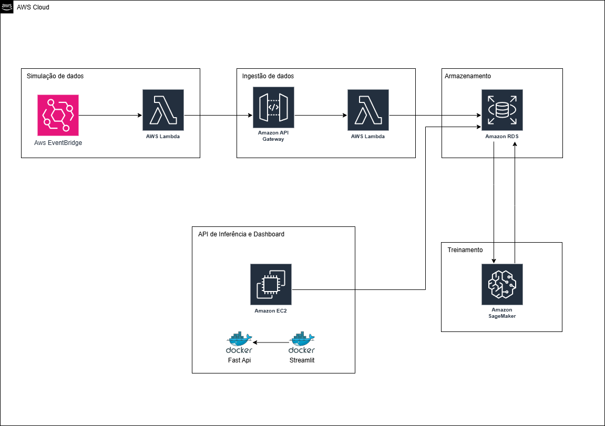

# FIAP - Faculdade de Informática e Administração Paulista

 

# Nome do projeto
### Enterprise Challenge

## Nome do grupo

## 👨‍🎓 Integrantes: 
- <a href="https://www.linkedin.com/in/arthur-alentejo">Arthur Guimarães Alentejo</a>
- <a href="https://www.linkedin.com/in/michaelrodriguess">Michael Rodrigues</a>
- <a href="https://www.linkedin.com/in/matheus-sacramento-de-lima-60512542/">Matheus Sacramento Lima</a> 
- <a href="https://www.linkedin.com/company/inova-fusca">Nathalia Vasconcelos</a> 
  
## 👩‍🏫 Professores:
### Tutor(a) 
- <a href="https://www.linkedin.com/company/inova-fusca">Lucas Gomes Moreira</a>
### Coordenador(a)
- <a href="https://www.linkedin.com/company/inova-fusca">Nome do Coordenador</a>

## O problema

Em ambientes industriais, falhas inesperadas em equipamentos podem gerar prejuízos significativos, tanto financeiros quanto operacionais. A manutenção corretiva, realizada apenas após a ocorrência de falhas, frequentemente resulta em paradas não planejadas, desperdício de recursos e compromete a segurança das operações. Portanto, prever falhas com antecedência torna-se essencial para melhorar a eficiência e a confiabilidade dos processos industriais.

A solução proposta visa construir uma arquitetura baseada em computação em nuvem que permita a **coleta, armazenamento, análise e visualização de dados de sensores** instalados em equipamentos industriais. Utilizando um dataset simulado com registros históricos de funcionamento, será possível treinar modelos preditivos de falhas utilizando **Amazon SageMaker**, integrando-os a uma API desenvolvida com **FastAPI** em uma instância **EC2**, responsável por expor os resultados das predições.

Para visualização dos dados e das previsões, será desenvolvido um **dashboard interativo com Streamlit**, acessível para usuários técnicos e de negócios. Todo o fluxo será orquestrado por serviços da **AWS**, como **EventBridge**, **Lambda** e **RDS**, garantindo escalabilidade, automação e viabilidade prática da solução.

Essa abordagem permitirá antecipar problemas, reduzir o tempo de inatividade e apoiar decisões estratégicas baseadas em dados.

## Definição das Tecnologias Utilizadas

A solução será implementada utilizando um conjunto de tecnologias modernas, que oferecem robustez, escalabilidade e integração com serviços de Machine Learning e computação em nuvem.

- **Linguagens de Programação**:  
  - **Python** será a linguagem principal, utilizada tanto para o processamento de dados quanto para o desenvolvimento da API e do dashboard.
  - **R** poderá ser utilizado para análises estatísticas mais específicas e exploração inicial dos dados.

- **Bibliotecas de Inteligência Artificial**:  
  - **Scikit-learn** será utilizada para treinar e validar modelos preditivos clássicos.
  - **Pandas** e **NumPy** serão empregadas para manipulação e análise de dados.
  - **Matplotlib** e **Seaborn** para visualização de dados exploratória.

- **Serviços de Nuvem (AWS)**:  
  - **Amazon EventBridge** será utilizado para orquestrar os eventos de simulação dos dados.
  - **AWS Lambda** processará os dados recebidos e enviará para o banco de dados.
  - **Amazon RDS** armazenará os dados dos sensores de forma relacional, facilitando consultas e integrações.
  - **Amazon SageMaker** será responsável pelo treinamento, validação e implantação dos modelos de Machine Learning.
  - **Amazon EC2** hospedará a aplicação FastAPI, que servirá como ponto de integração entre os serviços e o front-end.
  
- **Dashboard e Visualização**:  
  - **Streamlit** será utilizado para criar um dashboard interativo para visualização das métricas, dados em tempo real e previsões de falhas.

Essa combinação de ferramentas permite uma arquitetura flexível, com componentes desacoplados e de fácil manutenção, mantendo o foco em desempenho, escalabilidade e facilidade de uso.

## High-Level Design da Arquitetura Proposta

 

## Estratégia de Coleta de Dados

A coleta de dados será realizada de forma **simulada**, utilizando um dataset previamente obtido contendo registros históricos de sensores industriais. Esse dataset inclui leituras temporais de variáveis relevantes ao monitoramento de equipamentos, como temperatura, vibração, pressão, entre outros.

Para simular a chegada dos dados em tempo real, será criado um **job agendado** que irá alimentar o sistema com os dados seguindo a ordem cronológica original do dataset. Esse processo será orquestrado utilizando o **Amazon EventBridge**, que disparará eventos em intervalos configuráveis.

Cada evento acionará uma **função AWS Lambda**, que fará o envio dos dados simulados para o **API Gateway** que por sua vez acionará uma **função AWS Lambda** que fara o processamento dos dados simulados e enviará as informações para o banco de dados **Amazon RDS**, onde serão armazenadas e posteriormente utilizadas tanto para visualização em dashboard quanto para alimentar o modelo de previsão de falhas.

Essa estratégia permite testar toda a pipeline de forma controlada e reprodutível, simulando com fidelidade o comportamento de sensores reais em um ambiente industrial.

## Plano Inicial de Desenvolvimento e Divisão de Responsabilidades

O desenvolvimento será dividido em etapas com foco na construção da pipeline de dados, definição da arquitetura, treinamento do modelo preditivo e visualização dos resultados. Abaixo está a proposta de organização inicial da equipe:

### Definição da Arquitetura e Estratégia
- **Responsável:** *Arthur Guimarães Alentejo*
- Tarefas:
  - Estruturar a arquitetura de solução utilizando serviços da AWS.
  - Documentar a integração entre componentes da pipeline de dados.
  - Definir estratégias de simulação de dados.

### Simulação de Dados
- **Responsável:** *Nathalia Vasconcelos*
- Tarefas:
  - Configurar o job agendado com o Amazon EventBridge.
  - Criar função Lambda para leitura e envio dos dados simulados.

### Ingestão de Dados
- **Responsável:** *Matheus Sacramento Lima*
- Tarefas:
  - Configurar o Api gateway para a entrada de dados
  - Criar a função Lambda que irá processar os dados e enviar ao banco Amazon RDS
  - Configurar e criar as tabelas no banco Amazon RDS para receber os dados

### Processamento e Treinamento de Modelo
- **Responsável:** *Arthur Guimarães Alentejo*
- Tarefas:
  - Realizar análises exploratórias com Python e R.
  - Definir as features e preparar os dados para treinamento.
  - Utilizar o Amazon SageMaker para treinar o modelo de predição de falhas.

### API e Dashboard de Visualização
- **Responsável:** *Michael Rodrigues*
- Tarefas:
  - Desenvolver a API com FastAPI em uma instância EC2.
  - Criar o dashboard com Streamlit para visualização das predições.
  - Garantir a integração entre a API e a visualização dos dados.

### Observações
- Todos os membros contribuirão com a documentação e revisão do código no repositório privado no GitHub.

## 📁 Estrutura de pastas

Dentre os arquivos e pastas presentes na raiz do projeto, definem-se:

- <b>.github</b>: Nesta pasta ficarão os arquivos de configuração específicos do GitHub que ajudam a gerenciar e automatizar processos no repositório.

- <b>assets</b>: aqui estão os arquivos relacionados a elementos não-estruturados deste repositório, como imagens.

- <b>config</b>: Posicione aqui arquivos de configuração que são usados para definir parâmetros e ajustes do projeto.

- <b>document</b>: aqui estão todos os documentos do projeto que as atividades poderão pedir. Na subpasta "other", adicione documentos complementares e menos importantes.

- <b>scripts</b>: Posicione aqui scripts auxiliares para tarefas específicas do seu projeto. Exemplo: deploy, migrações de banco de dados, backups.

- <b>src</b>: Todo o código fonte criado para o desenvolvimento do projeto ao longo das 7 fases.

- <b>README.md</b>: arquivo que serve como guia e explicação geral sobre o projeto (o mesmo que você está lendo agora).

## 🔧 Como executar o código

*Para executar o projeto localmente, é necessário ter Docker e Docker Compose instalados. Clone o repositório, navegue até a pasta raiz e execute docker-compose up --build. Isso iniciará dois containers: a API (FastAPI) acessível em http://localhost:8000 e o Dashboard (Streamlit) em http://localhost:8501. Para encerrar, use docker-compose down.*

## 🗃 Histórico de lançamentos

* 0.1.0 - XX/XX/2024
    *

## 📋 Licença

<a property="dct:title" rel="cc:attributionURL" href="https://github.com/agodoi/template">MODELO GIT FIAP</a> por <a rel="cc:attributionURL dct:creator" property="cc:attributionName" href="https://fiap.com.br">Fiap</a> está licenciado sobre <a href="http://creativecommons.org/licenses/by/4.0/?ref=chooser-v1" target="_blank" rel="license noopener noreferrer" style="display:inline-block;">Attribution 4.0 International</a>.

